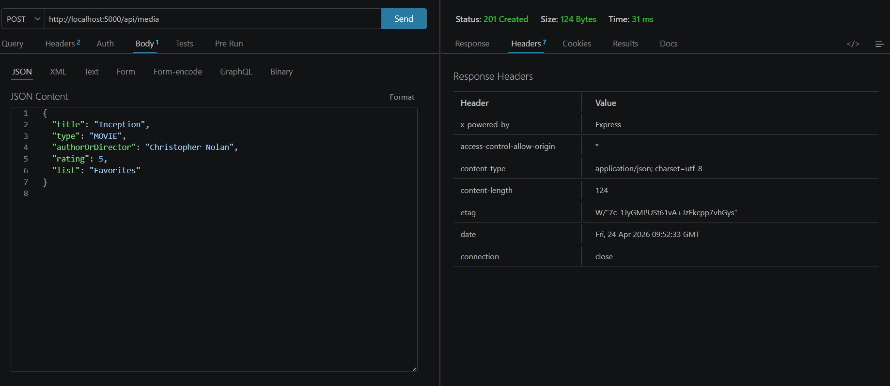
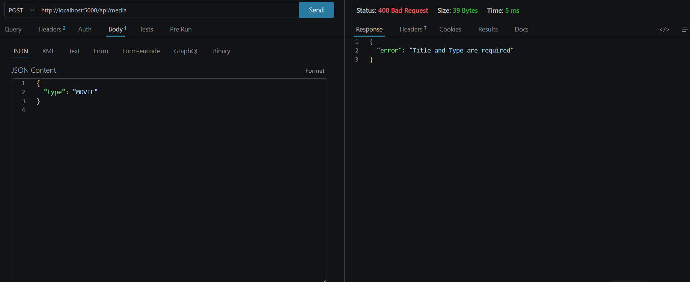
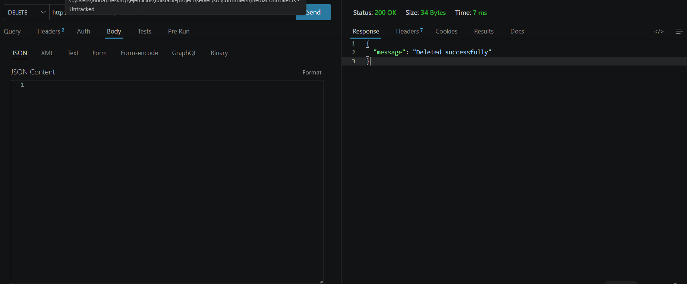

# 📡 Especificación de la API - Frame & Page

Este documento detalla los puntos de entrada (endpoints) de la API y los códigos de respuesta implementados para garantizar una comunicación robusta.

## 🏗️ Endpoints y Métodos HTTP


| Método | Ruta | Acción | Código de Éxito |
| :--- | :--- | :--- | :--- |
| **GET** | `/api/media` | Obtener toda la biblioteca | `200 OK` |
| **POST** | `/api/media` | Crear nueva publicación | `201 Created` |
| **PUT** | `/api/media/:id` | Editar publicación existente | `200 OK` |
| **DELETE** | `/api/media/:id` | Eliminar publicación | `200 OK` |

---

## 🚦 Gestión de Respuestas y Códigos HTTP

A continuación se muestran las pruebas realizadas en **Thunder Client** que validan el comportamiento del servidor:

### 1. Obtener Datos (`200 OK`)
Respuesta exitosa al consultar la lista completa de ítems.


### 2. Crear Contenido (`201 Created`)
Respuesta al enviar un JSON válido. El servidor retorna el objeto con su nuevo ID.


### 3. Error de Validación (`400 Bad Request`)
El servidor rechaza la petición si faltan campos obligatorios como el título.


### 4. Borrado Exitoso (`200 OK`)
Confirmación de que el ítem con el ID especificado ha sido eliminado.


### 5. Recurso no Encontrado (`404 Not Found`)
Respuesta al intentar borrar o editar un ID que ya no existe en el sistema.


---

## 🛠️ Especificación OpenAPI (Swagger)
Esta API sigue el estándar **OpenAPI 3.0**. A continuación se muestra el esquema del objeto `MediaItem` utilizado para el intercambio de datos:

```json
{
  "openapi": "3.0.0",
  "info": {
    "title": "Frame & Page API",
    "version": "1.0.0"
  },
  "components": {
    "schemas": {
      "MediaItem": {
        "type": "object",
        "required": ["title", "type"],
        "properties": {
          "id": { "type": "integer", "example": 1714820541234 },
          "title": { "type": "string", "example": "Inception" },
          "type": { "type": "string", "enum": ["BOOK", "MOVIE", "TV_SERIES"] },
          "authorOrDirector": { "type": "string", "example": "Christopher Nolan" },
          "rating": { "type": "integer", "minimum": 1, "maximum": 5 },
          "list": { "type": "string", "example": "Favorites" }
        }
      }
    }
  }
}
```

*Nota: Esta especificación permite la generación automática de clientes y mocks, asegurando la interoperabilidad del sistema.*
