# Arquitectura de la Aplicación

Este documento detalla las decisiones técnicas respecto a la estructura de componentes y la gestión del estado para asegurar una aplicación escalable y mantenible.

## 1. Estructura de Componentes

La aplicación sigue un patrón de diseño basado en la composición de componentes, divididos según su responsabilidad:

### 1.1 Layout Components (Estructurales)
Componentes que definen el "esqueleto" de la interfaz y se mantienen constantes durante la navegación:
- **MainLayout:** Contenedor principal que envuelve todas las páginas.
- **Navbar:** Barra de navegación con accesos rápidos y estado de sesión.
- **Footer:** Pie de página con información institucional.

### 1.2 Page Components (Vistas)
Componentes de alto nivel que representan las rutas de la aplicación:
- **HomeView:** Renderiza el muro social privado con las reseñas de amigos.
- **LibraryView:** Muestra la colección personal con sistemas de filtrado.
- **AddContentView:** Gestiona el formulario inteligente de registro.

---

## 2. Componentes Reutilizables (UI Kit)

Para garantizar la consistencia visual y reducir la duplicación de código, se han identificado los siguientes componentes clave en la carpeta `src/components/`:

- **MediaCard:** Tarjeta estandarizada para mostrar libros, series o películas. Recibe datos mediante *props* y adapta su diseño al tipo de contenido.
- **DynamicForm:** Formulario que utiliza lógica condicional para renderizar campos específicos según la categoría seleccionada (ej: páginas para libros vs capítulos para series).
- **StarRating:** Componente de interfaz para la visualización y selección de calificaciones de 0 a 5.
- **Badge:** Etiquetas de colores dinámicos (usando Tailwind) para identificar visualmente el tipo de media.
- **Button / Input:** Componentes base con los estilos corporativos definidos.

---

## 3. Gestión del Estado

Se ha definido una estrategia de estado en tres niveles para optimizar el rendimiento y la experiencia de usuario:

### 3.1 Estado Local (`useState`)
Utilizado para datos efímeros y específicos de un componente:
- Control de modales (abierto/cerrado).
- Valores temporales de formularios antes del envío.
- Términos de búsqueda en tiempo real.

### 3.2 Estado Global (`Context API`)
Se utilizará **React Context** para evitar el *Prop Drilling* en datos que requiere toda la aplicación:
- **AuthContext:** Almacena el estado del usuario, el token JWT y los permisos de acceso.
- **MediaContext:** Centraliza la lista de contenido para sincronizar los cambios entre la Biblioteca y el Muro Social.

### 3.3 Estado de Navegación (`React Router`)
Uso de la URL como fuente de verdad para:
- Rutas dinámicas.
- Parámetros de filtrado y búsqueda, permitiendo que las vistas sean "compartibles" y persistentes al recargar.

---

## 4. Diseño de la API (Recursos REST)

La comunicación entre el cliente y el servidor se basará en una arquitectura RESTful, utilizando el prefijo `/api/v1` para el versionado de la API.

### 4.1 Endpoints y Verbos HTTP


| Recurso   | Método | Endpoint                | Descripción                                      |
| :-------- | :----- | :---------------------- | :----------------------------------------------- |
| **Auth**  | POST   | `/api/v1/auth/register` | Registro de nuevos usuarios.                     |
| **Auth**  | POST   | `/api/v1/auth/login`    | Autenticación y generación de token JWT.         |
| **Media** | GET    | `/api/v1/media`         | Obtener la biblioteca personal del usuario.      |
| **Media** | POST   | `/api/v1/media`         | Crear un nuevo registro (Libro/Serie/Película).  |
| **Media** | PUT    | `/api/v1/media/:id`     | Actualizar datos o reseña de un ítem existente.  |
| **Media** | DELETE | `/api/v1/media/:id`     | Eliminar un ítem de la biblioteca.               |
| **Social**| GET    | `/api/v1/social/feed`   | Obtener las últimas reseñas de los amigos.       |

### 4.2 Contratos de Datos (Modelos JSON)
#### Envío de nuevo ítem (Request Body - POST)
Para manejar la lógica condicional, el objeto varía según el campo `type`:

```json
{
  "type": "BOOK", // O "MOVIE", "TV_SERIES"
  "title": "El resplandor",
  "author": "Stephen King", // Específico de BOOK
  "pages": 600,            // Específico de BOOK
  "rating": 5,
  "review": "Una obra maestra del terror psicológico.",
  "coverUrl": "https://imagen.com"
}
```

#### Ejemplo de Respuesta de la API (JSON)
Este es el formato de datos que el servidor enviará al frontend cuando solicitemos información:

```json
{
  "id": "uuid-001",
  "type": "TV_SERIES",
  "title": "The Bear",
  "seasons": 2,
  "episodes": 18,
  "rating": 5,
  "user": {
    "username": "Ainoa",
    "avatar": "url-avatar"
  },
  "createdAt": "2024-04-16T10:00:00Z"
}
```

### 4.3 Códigos de Respuesta Estándar
- **200 OK**: Petición exitosa.
- **201 Created**: Recurso creado con éxito (registro o nuevo ítem).
- **400 Bad Request**: Datos de entrada inválidos o faltantes.
- **401 Unauthorized**: Falta de token de autenticación o token inválido.
- **404 Not Found**: El recurso solicitado no existe en la base de datos.

---

## 5. Persistencia de Datos (Cliente vs. Servidor)

Se ha definido una estrategia de persistencia para diferenciar qué información requiere almacenamiento permanente y cuál es volátil.

### 5.1 Datos Persistidos en el Servidor (Base de Datos)
Estos datos son permanentes y accesibles desde cualquier dispositivo tras el inicio de sesión:
- **Información de Usuario:** Credenciales (hash de password), perfil, avatar y relación de amigos.
- **Catálogo Media:** Todos los registros de libros, películas y series creados por el usuario.
- **Interacciones:** Reseñas, calificaciones de estrellas y "likes" en publicaciones de amigos.
- **Metadatos:** Fecha de creación y actualización de cada registro.

### 5.2 Datos Persistidos en el Cliente (Navegador)
Datos que mejoran la experiencia de usuario (UX) o mantienen el estado de la sesión localmente:
- **Token JWT:** Almacenado en `localStorage` o `Cookies` para mantener la sesión activa sin pedir login constantemente.
- **Preferencias de Interfaz:** Configuración de Modo Oscuro/Claro o idioma preferido.
- **Estado de Filtros:** Los filtros aplicados actualmente en la biblioteca (ej: "solo mostrar libros") se mantienen durante la sesión para evitar frustración al navegar.
- **Borradores Temporales:** Datos del formulario "ADD" que aún no han sido enviados, para evitar pérdida de información ante un cierre accidental.

---

## 6. Diagrama de Flujo de Datos

El siguiente diagrama describe cómo viaja la información desde que el usuario interactúa con la interfaz hasta que los datos se guardan en la base de datos.

```mermaid
graph LR
    subgraph Frontend [Cliente / Navegador]
        A[Interfaz React] -->|1. Acción: Crear Libro| B[Estado de Componente]
        B -->|2. Petición HTTP POST + JWT| C[Cliente API / Axios]
    end

    subgraph Backend [Servidor Express]
        C -->|3. Ruta /api/v1/media| D[Controlador]
        D -->|4. Validar Datos| E[Servicio / Lógica de Negocio]
        E -->|5. Guardar| F[Prisma ORM]
    end

    subgraph Database [Persistencia]
        F -->|6. INSERT INTO| G[(PostgreSQL / MongoDB)]
    end

    G -->|7. Confirmación| F
    F -->|8. Datos Creados| E
    E -->|9. Respuesta JSON| D
    D -->|10. Status 201 OK| C
    C -->|11. Actualizar Estado| B
    B -->|12. Renderizar Tarjeta| A
```


### 6.1 Descripción del proceso
1. **Frontend**: El usuario interactúa con la UI (ej. rellena el formulario de "Añadir libro") y React captura los datos en el estado local.
2. **API**: El cliente envía una petición HTTP (POST) empaquetada en formato JSON, incluyendo el token JWT en las cabeceras para autenticar la sesión.
3. **Backend**: El servidor Express recibe la petición, valida los campos y verifica la identidad del usuario a través de los controladores.
4. **Persistencia**: El servicio se comunica con el ORM (Prisma), que traduce la lógica a una consulta de base de datos para guardar la información permanentemente.
5. **Retorno**: Una vez confirmado el guardado, el servidor devuelve una respuesta exitosa (Status 201) que el frontend utiliza para actualizar la interfaz sin recargar la página.
